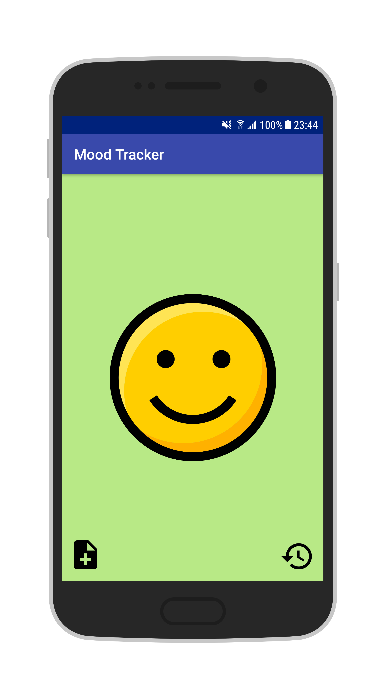
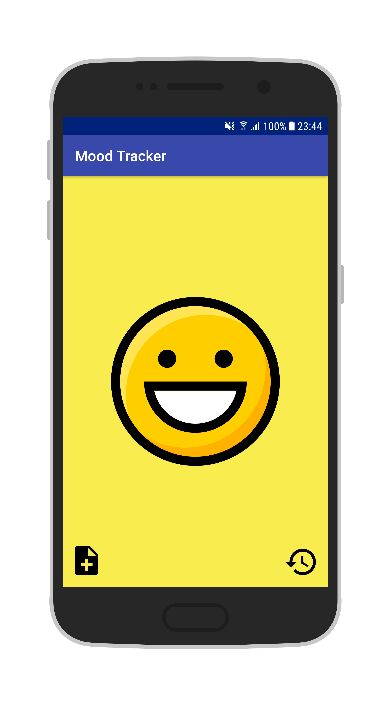
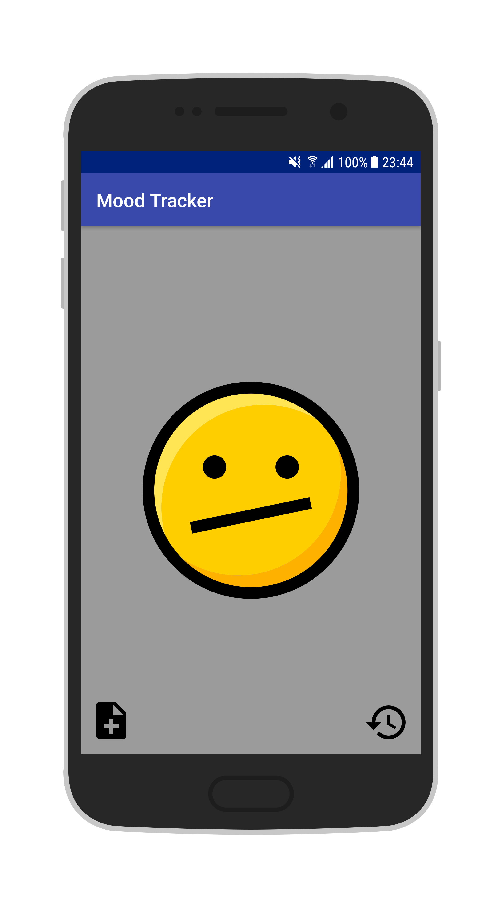
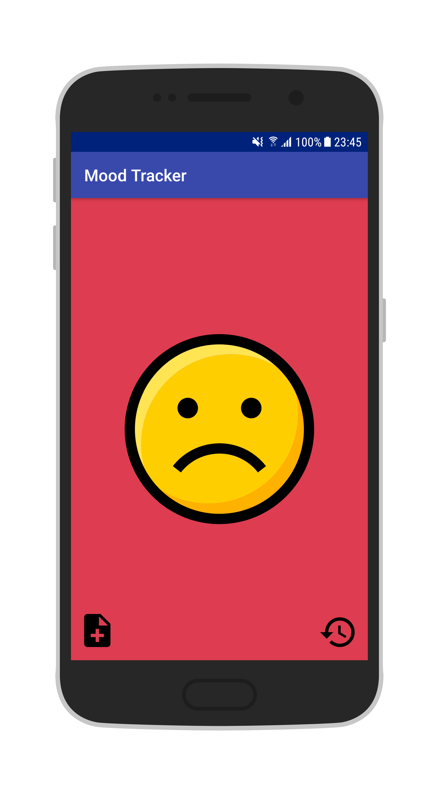
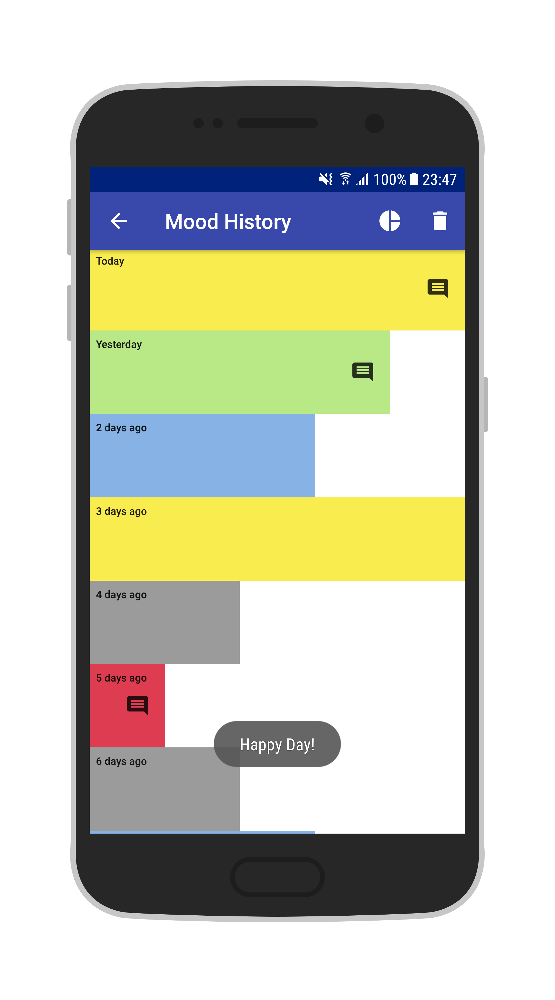
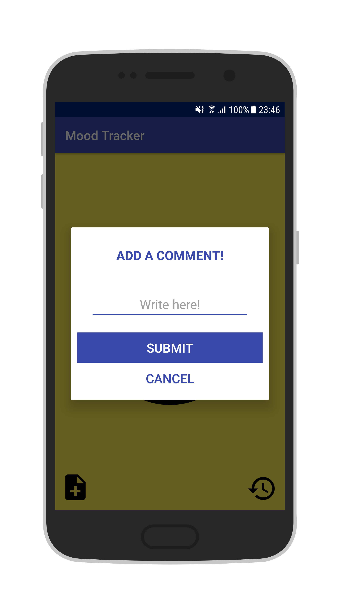
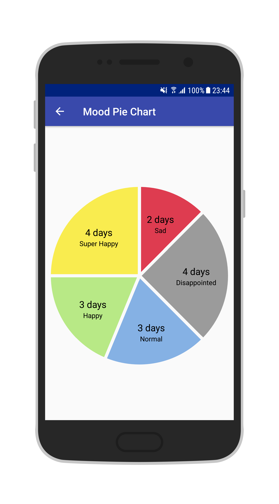

# MoodTracker

Note: This project is outdated. Please, check MoodTracker V2.

MoodTracker is a simple app that allows you to record your mood within the application on a daily basis. If you want, you can add a note to give more information on why you're feeling a certain way (ex. "I got a new job! 😃" or "There was no cheesecake left for dessert 😞 "). 

Your mood history is saved for a week, allowing you to see your general mood trends. Any comment you've left can also be consulted. Additionally, you can see your mood history in a pie chart.

## Screenshots

&ensp;&ensp;

&ensp;

&ensp;&ensp;

## Libraries

* [Android Support Library](https://developer.android.com/topic/libraries/support-library/)
* [MP Android Chart](https://github.com/PhilJay/MPAndroidChart)

## Developed By

Diego Fajardo

    Copyright 2018 Diego Fajardo
    
    Licensed under the Apache License, Version 2.0 (the "License");
    you may not use this file except in compliance with the License.
    You may obtain a copy of the License at

        http://www.apache.org/licenses/LICENSE-2.0

    Unless required by applicable law or agreed to in writing, software
    distributed under the License is distributed on an "AS IS" BASIS,
    WITHOUT WARRANTIES OR CONDITIONS OF ANY KIND, either express or implied.
    See the License for the specific language governing permissions and
    limitations under the License.
